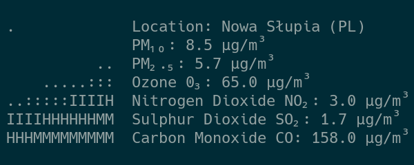

# smoggy

<p align="center">

</p>

A simple tool for fetching air quality information. The data provider is [Open-Meteo](https://open-meteo.com/).

## Usage

```sh
# Basic usage
smoggy

# Specify city
smoggy "Nowa Słupia"
```

## Build from source

To compile and run smoggy, you need to install the `libcjson` and `libcurl` libraries.

1. Clone the repository.
2. Build from source code using the `make` command.

## Similar projects

- [stormy](https://github.com/ashish0kumar/stormy)
- [rainy](https://github.com/liveslol/rainy)
